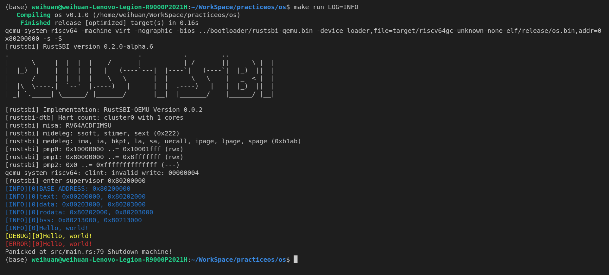

ch1 作业
log截图:

rustsbi委托的异常/中断

根据上面的运行截图可以看出:

mideleg委托了管态外部中断sext，管态时钟中断stimer，管态软中断ssoft

medeleg委托了指令对齐异常ima，指令错误异常ia，断点异常bkpt，加载对齐异常la，存取对齐异常sa，用户态环境调用uecall，指令页错误异常，加载页错误，存取页错误异常
初始运行过程

最开始在机器态执行，pc指针位置是1000，获取了核id后跳转到0x80000000执行rustsbi程序

rustsbi先是执行runtime::init, 根据启动核id找到核的栈，然后执行接下来的初始化堆，标准输入输出，时钟中断，测试复位，屏幕输出sbi信息，委托中断和异常，设置物理内存页，设置中断使能等之后跳转到0x80200000执行，状态变成管态
